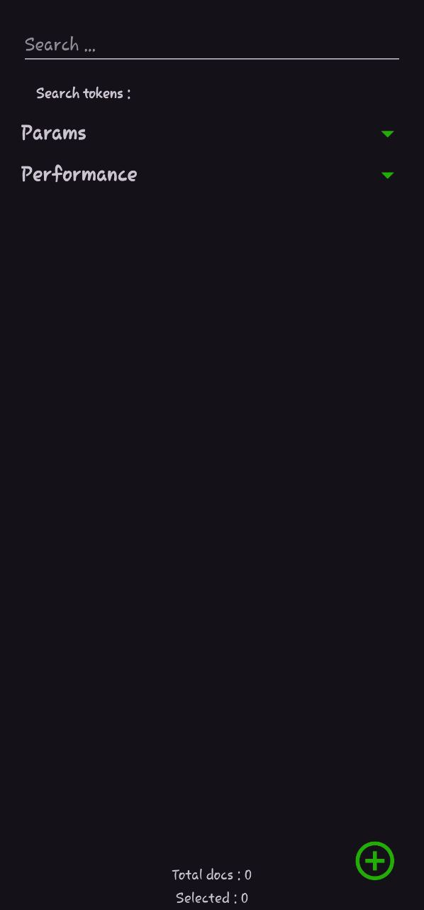
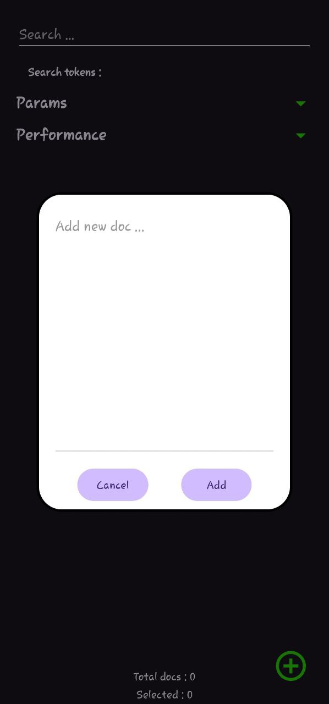
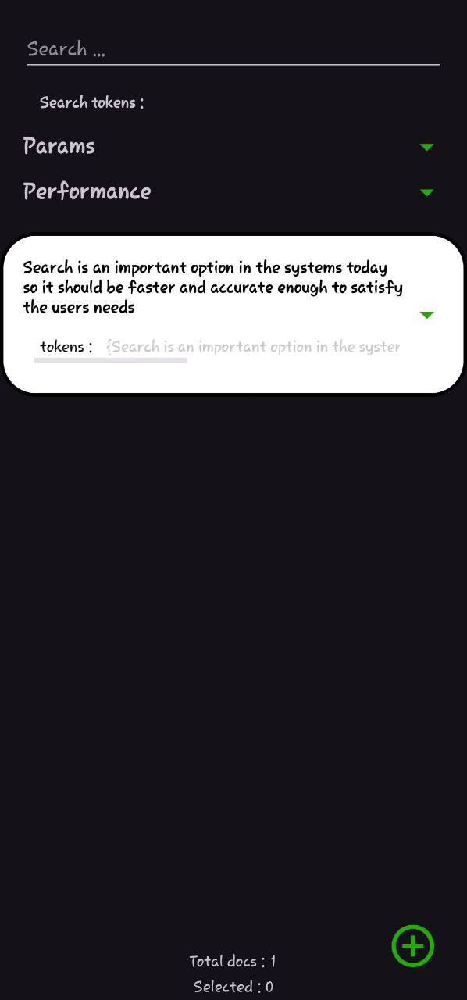
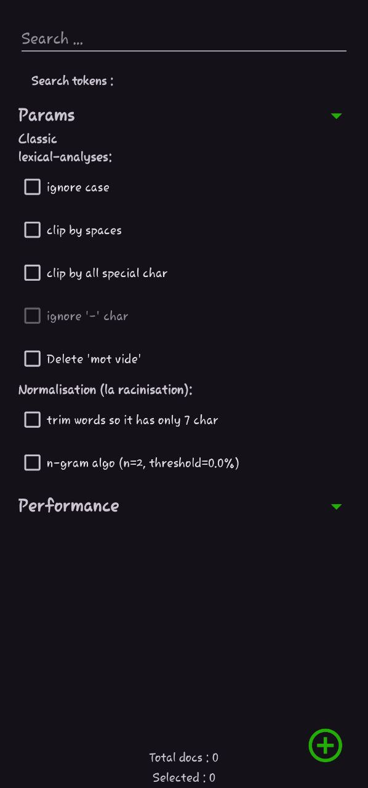
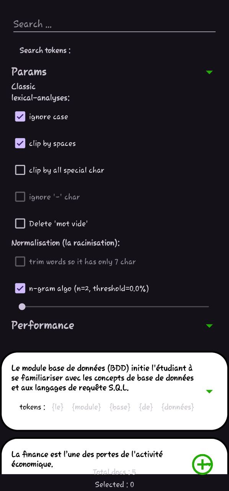
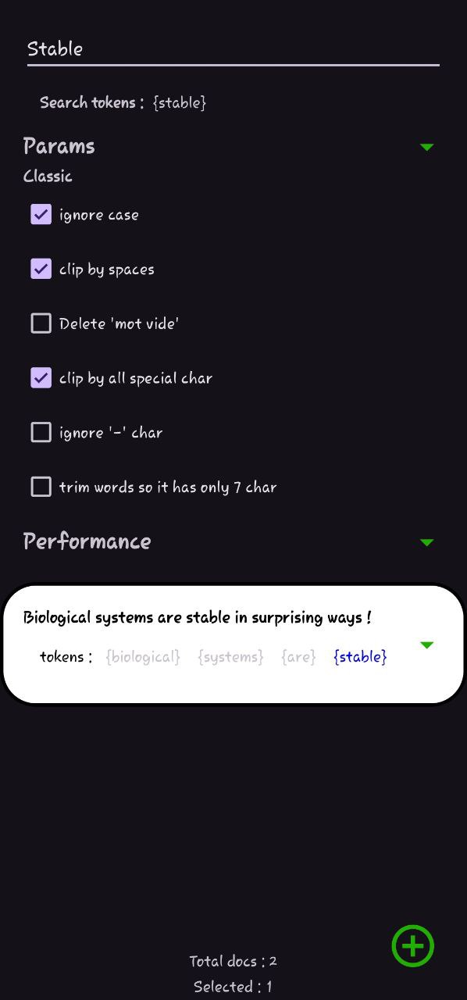
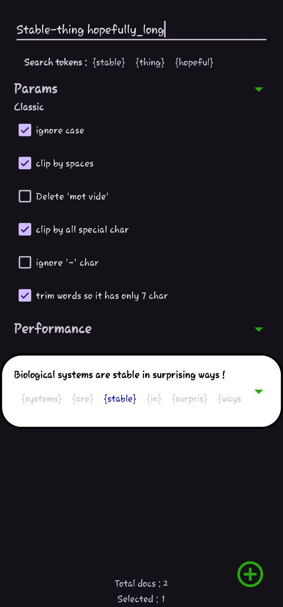
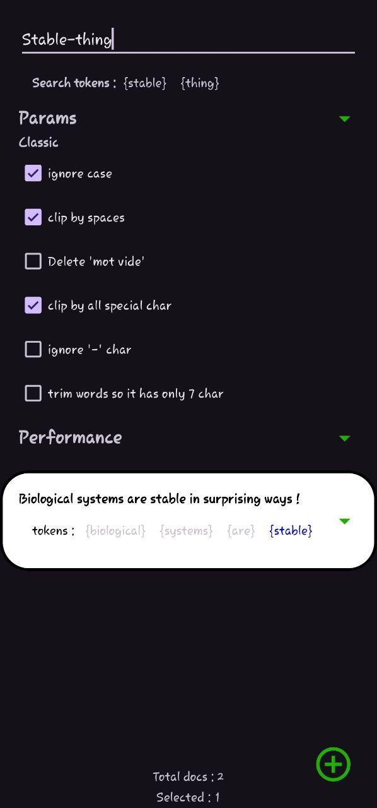
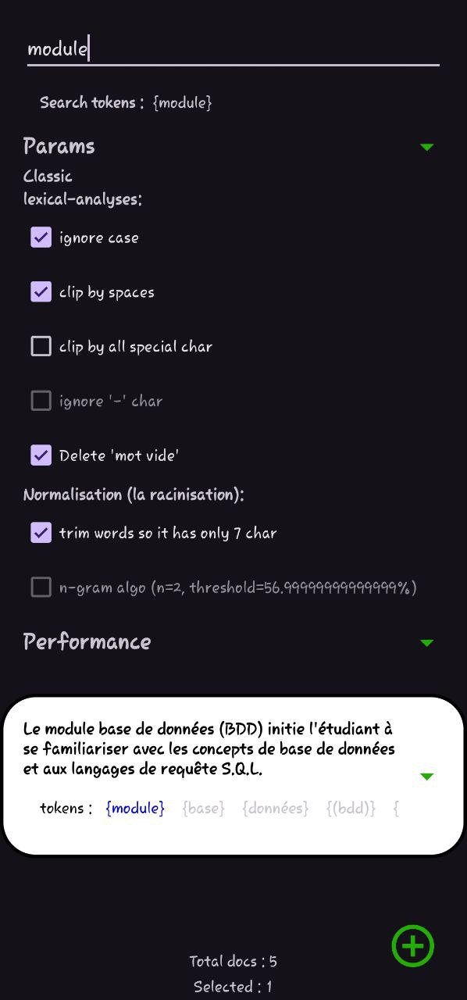
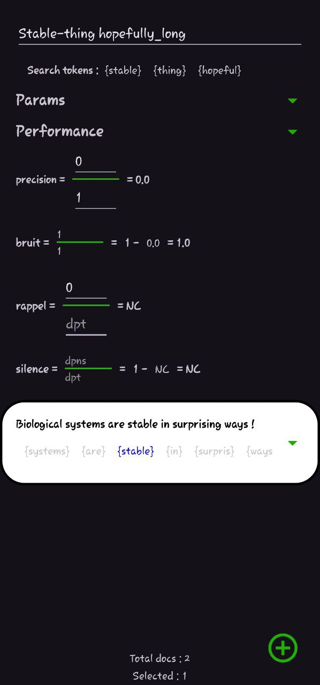

  

# SRI LITE Simulation
A Lite Android application to simulate the work of ***SRI*** (***Un Systeme de recherch d'information***) in eng : Information Search System,
This app deals with docs as only simple strings that won't be saved on the local drive (All the work is done on RAM only).

## 🔥 Motivation :
I was amazed by how ***SRI*** works, so I decided to create this simulation to better understand its functionalities in document indexing 😎.  

## 🧩 Functionalities :
🟢 Adding and deleting docs.  
🟢 Searching among the added docs.  
🟢 Apply filters ( Of the classic ***SRI*** ).  
🟢 Space to calculate the algorithmic Performance of each filter.

## 📈 Future Features :
- Adding filters of the advanced (***SRI***)

## ❄️ Functionalities That Won't Be Included :
🔴 Using Local disk to store docs.  
🔴 Web-Crawling
> because: those are easy to implement and take a lot of computing resources, which is beyond the scope or objective of this project ☃️.

## ⛰️ ScreenShots :
Some screenshots from the app

    
     
     
     
     
     
     
     
    
     

